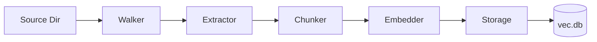

# VecBound Technical Overview

VecBound is a local-first semantic search engine designed for developers and RAG pipelines. This document details its architecture and data processing workflows.

---

## High-Level Architecture
VecBound is a modular Go CLI using a pipeline architecture. Data flows through five stages: Walk, Extract, Chunk, Embed, and Store.

---

## The Data Pipeline

### 1. Walker & Registry (internal/processor)
The `Walker` identifies supported files and uses a registry to map extensions to specialized extractors:
- **Documents:** PDF, DOCX/XLSX, HTML.
- **OpenDocument:** ODT/ODS/ODP (ZIP-based XML parsing).
- **Structured Data:** JSON, CSV, YAML, SQL.

### 2. Chunking
Text is split into overlapping chunks (default: 500 characters with 50-character overlap) to maintain semantic context at split boundaries.

### 3. Embedding Engine (internal/embedder)
- **Model:** `all-MiniLM-L6-v2` (ONNX).
- **Runtime:** `onnxruntime_go` for local inference.
- **Tokenizer:** Custom WordPiece tokenizer.
- **Discovery:** Locates runtime libraries (`libonnxruntime.so`) and model files automatically.

---

## Storage & Integrity

### Database Schema
VecBound uses SQLite for portability.
- **documents:** File paths and metadata.
- **chunks:** Raw text and sequence indices.
- **vectors:** High-dimensional embeddings (BLOBs) linked via foreign keys.

### Data Integrity
1. **Cascading Deletes:** `ON DELETE CASCADE` ensures no orphaned vectors.
2. **Document-Level Cleanup:**Purges old chunks/vectors before re-indexing a file.
3. **Atomic Transactions:** Per-file indexing is transactional.

---

## Search & Export

### Vector Similarity
Search calculates cosine similarity between the query embedding and stored vector BLOBs locally in Go.

### Result Management
- **Deduplication:** Filters by `Path + Content` to ensure unique results.
- **Context Windowing:** Finding the query's location and centering a window around it.
- **Multi-Format Export:** Supports JSON, JSONL, CSV, Markdown, and Table formats.

---

## Integration
VecBound is designed for integration with other languages (Laravel, Node.js).
- **Streaming:** Use `--format jsonl` for line-by-line processing.
- **Management:** Use `./vecbound index --clear` for a total database refresh.
